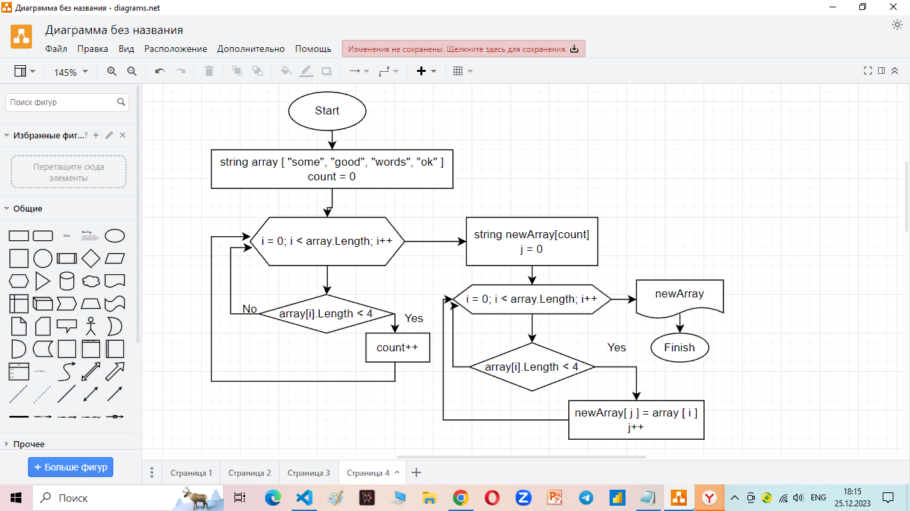

# Контрольная работа

## Задание:

Данная работа необходима для проверки ваших знаний и навыков по итогу прохождения первого блока обучения на программе Разработчик. Мы должны убедится, что базовое знакомство с IT прошло успешно.

Задача алгоритмически не самая сложная, однако для полноценного выполнения проверочной работы необходимо:

1. Создать репозиторий на GitHub
2. Нарисовать блок-схему алгоритма (можно обойтись блок-схемой основной содержательной части, если вы выделяете её в отдельный метод)
3. Снабдить репозиторий оформленным текстовым описанием решения (файл README.md)
4. Написать программу, решающую поставленную задачу
5. Использовать контроль версий в работе над этим небольшим проектом (не должно быть так, что всё залито одним коммитом, как минимум этапы 2, 3, и 4 должны быть расположены в разных коммитах)

### Задача: 
Написать программу, которая из имеющегося массива строк формирует новый массив из строк, длина которых меньше, либо равна 3 символам. Первоначальный массив можно ввести с клавиатуры, либо задать на старте выполнения алгоритма. При решении не рекомендуется пользоваться коллекциями, лучше обойтись исключительно массивами.

### Примеры:
[“Hello”, “2”, “world”, “:-)”] → [“2”, “:-)”]
[“1234”, “1567”, “-2”, “computer science”] → [“-2”]
[“Russia”, “Denmark”, “Kazan”] → []

## Переходим к решению:

1. Создадим репозиторий на гидхабе:

>[Вот и он](https://github.com/Only-Anton/induction_course_results.git "Ссылка на репозиторий")

2. Нарисовать блоксхему:

поместим сюда картинку 



3. Ну мы впринципе этим сейчас и занимаемся.

4. Программа написанна и к счастью даже работает, подробности будут далее.

5. Ну тут тоже на всякий случай вставлю картинку со скриншотом.

## Вернемся к пункту 3:

* Нам дан массив
```sh
string[] array = new string[] {"we", "all", "live", "in", "yellow", "submarin"};
```
Но мы так же можем ввести его с клавиатуры, тут немного сложнее (хотя, возможно, именно я все и усложняю), я бы не стал сейчас это делать, но этод код уже был мной написан к одной домашней работе, для самопроверки. Просто немного обидно, сидел, думал, тратил время, а в итоге никто этого и не увидел, по этому решил тут его и использовать.

А выглядит это все следующим образом:
```sh
string[] ConvertToArray(string text)
{
    int l = text.Length;
    int count = 1;
    for (int i = 0; i < l; i++)
        if (text[i] == ' ')
            count++;
    string[] array = new string[count];
    count = 0;
    for (int i = 0; i < l; i++)
        if (text[i] == ' ')
            count++;
        else
            array[count] += text[i];
    return array;
}

Console.Write("Enter some words: ");
string text = Console.ReadLine()!;
string[] array = ConvertToArray(text);
```
И да, код будет работать только при условии разделений слов одним пробелом, если пробелов будет больше то увы :(


* Следующее что надо бы сделать, это создать новый массив, но вот только какой длинны?

Что бы не годать, давайте лучше посчитаем сколько элементов в первоначальном маччиве содержит 3 и менее символов.
И да, кстати, непомешает ввести переменную для подсчета.

```sh
int count = 0;
for (int i = 0; i < array.Length; i++)
    if (array[i].Length < 4) count++;
```

* Теперь можем смело вводить новый массив, если конечно колличество его элементов не равно нулю

так что если
```sh
if (count > 0)
```

то продолжаем

```sh
string[] newArray = new string[count];
```

* Ну а теперь запускаем новый цикл, что бы скопировать в созданный массив элементы из старого, но только те, которые удовлетворяют нашему условию.

не забываем перед этим ввести еще одну переменную, так как индексы у массивов скорее всего совпадать не будут (хотя могут и совпадать, если напритмер все элементы у нас имеют не более трех символов):

```sh
int j = 0;
```

```sh
for (int i = 0; i < array.Length; i++)
    {
        if (array[i].Length < 4)
        {
            newArray[j] = array[i];
            j++;
        }
    }
```

* Ну и финиш!!! Выводим наш новый массив на экран, если конечно до этого у нас соблюлось условие, что он имеет хотя бы один элемент:

```sh
Console.WriteLine($"Преобразованный массив: [{string.Join(" ", newArray)}]");
```

А иначе, просто, что-нибудь напишем:

```sh
else Console.WriteLine("В первоначальном массиве все элементы длиннее 3-х символов");
```
